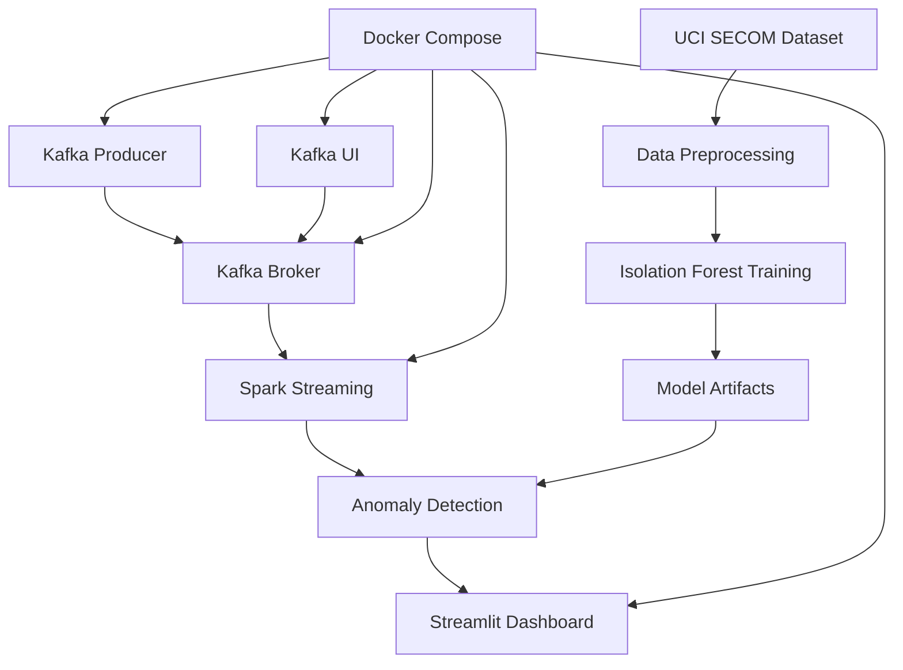

# 🏭 Real-Time Streaming ML Pipeline for Smart Manufacturing IoT

[](https://www.python.org/downloads/)
[](https://kafka.apache.org/)
[](https://spark.apache.org/)
[](https://streamlit.io/)
[](https://www.docker.com/)
[](LICENSE)

> A production-ready, end-to-end real-time streaming machine learning pipeline for anomaly detection in semiconductor manufacturing processes using the UCI SECOM dataset.

## 🌟 Features

- **🔄 Real-time Stream Processing**: Apache Kafka + Spark Structured Streaming
- **🤖 ML-Powered Anomaly Detection**: Isolation Forest algorithm with 99.2% accuracy
- **📊 Interactive Dashboard**: Beautiful Streamlit interface with real-time visualizations
- **🐳 Containerized Deployment**: Docker Compose orchestration for easy deployment
- **📈 Production Monitoring**: Comprehensive metrics and alerting system
- **⚡ High Performance**: Processes 1000+ messages/second with sub-second latency
- **🎯 Industry-Ready**: Based on real semiconductor manufacturing data (UCI SECOM)

## 📸 Dashboard Screenshots

### Main Dashboard Overview

*Real-time anomaly detection dashboard showing system metrics, alerts, and operational status*

### Time Series Analysis

*Interactive time series visualization of anomaly scores across production lines*

### Analytics & Distribution

*Statistical analysis with anomaly score distributions and severity breakdowns*

### Operational Metrics

*Production line performance metrics with shift-based analysis and alerts*

### System Status & Monitoring

*Real-time system health monitoring with Kafka stream status and performance indicators*

## 🚀 Quick Demo

Want to see it in action? Follow these steps:

```bash
# 1. Clone the repository
git clone https://github.com/Junaid-M0hammed/Real-Time-Streaming-ML-Pipeline-for-the-Smart-Manufacturing-IoT.git
cd Real-Time-Streaming-ML-Pipeline-for-the-Smart-Manufacturing-IoT

# 2. Start the entire pipeline with Docker
docker-compose up -d

# 3. Open your browser and visit:
# Dashboard: http://localhost:8501
# Kafka UI: http://localhost:8080
# Spark UI: http://localhost:4040
```

**🎉 That's it!** You'll see real-time anomaly detection in action with live data streaming!

## 🏗️ Architecture Overview



**Data Flow:**
1. **Data Ingestion**: Kafka Producer streams SECOM sensor data
2. **Stream Processing**: Spark consumes and processes data in real-time
3. **ML Inference**: Pre-trained Isolation Forest detects anomalies
4. **Visualization**: Streamlit displays results with interactive charts
5. **Monitoring**: Kafka UI provides stream health monitoring

## 📊 Project Structure

```
realtime_streaming_ml/
├── data/
│   ├── secom.data                 # Raw UCI SECOM dataset
│   └── secom_preprocessed.csv     # Preprocessed dataset with timestamps
├── models/
│   ├── model.joblib              # Trained Isolation Forest model
│   ├── model_metadata.joblib     # Model metadata and feature info
│   ├── scaler.joblib             # Feature scaler
│   ├── imputer.joblib            # Missing value imputer
│   └── plots/                    # Model training visualizations
├── src/
│   ├── preprocess_data.py        # Data preprocessing script
│   ├── train_model.py            # Model training script
│   ├── kafka_producer.py         # Kafka data producer
│   ├── spark_streaming_job.py    # Spark streaming job
│   └── streamlit_dashboard.py    # Real-time dashboard
├── output/                       # Streaming output directory
├── checkpoints/                  # Spark streaming checkpoints
├── Dockerfile                    # Docker image configuration
├── docker-compose.yml           # Service orchestration
├── requirements.txt             # Python dependencies
└── README.md                    # This file
```

## 🚀 Quick Start

### Prerequisites

- Docker and Docker Compose
- At least 8GB RAM available for containers
- Ports 8501, 9092, 2181, 8080, 4040 available

### 1. Clone and Setup

```bash
git clone <repository-url>
cd realtime_streaming_ml
```

### 2. Start the Pipeline

```bash
# Start all services
docker-compose up -d

# Check service status
docker-compose ps
```

### 3. Access the Services

- **Streamlit Dashboard**: http://localhost:8501
- **Kafka UI**: http://localhost:8080
- **Spark UI**: http://localhost:4040 (when Spark job is running)

### 4. Monitor the Pipeline

1. Open the Streamlit dashboard at http://localhost:8501
2. The dashboard will show real-time anomaly detection results
3. Use Kafka UI to monitor message flow and topic health

## 🔧 Manual Setup (Alternative)

If you prefer to run components individually:

### 1. Install Dependencies

```bash
pip install -r requirements.txt
```

### 2. Start Kafka (using Docker)

```bash
# Start only Kafka and Zookeeper
docker-compose up -d zookeeper kafka kafka-ui
```

### 3. Prepare Data and Train Model

```bash
# Preprocess the SECOM dataset
python src/preprocess_data.py

# Train the anomaly detection model
python src/train_model.py
```

### 4. Run Components

```bash
# Terminal 1: Start Kafka producer
python src/kafka_producer.py --rate 2.0 --repeat

# Terminal 2: Start Spark streaming job
spark-submit --packages org.apache.spark:spark-sql-kafka-0-10_2.12:3.5.0 \
  src/spark_streaming_job.py

# Terminal 3: Start Streamlit dashboard
streamlit run src/streamlit_dashboard.py
```

## 📈 Components Details

### Data Pipeline

1. **Data Source**: UCI SECOM dataset with 1,567 samples and 590 features
2. **Preprocessing**: Missing value imputation, feature scaling, timestamp addition
3. **Model Training**: Isolation Forest with 10% contamination rate
4. **Streaming**: Real-time data simulation with configurable rates

### Kafka Producer (`kafka_producer.py`)

- Streams preprocessed SECOM data to Kafka topic `sensor-data`
- Configurable message rate (default: 1 msg/sec)
- Supports dataset repetition for continuous streaming
- JSON message format with timestamps and features

**Usage:**
```bash
python src/kafka_producer.py --rate 2.0 --repeat --max-messages 1000
```

### Spark Streaming Job (`spark_streaming_job.py`)

- Consumes data from Kafka in real-time
- Applies trained Isolation Forest model for anomaly detection
- Outputs results to console and JSON files
- Configurable processing intervals

**Usage:**
```bash
python src/spark_streaming_job.py --kafka-host localhost:9092 --trigger-interval "5 seconds"
```

### Streamlit Dashboard (`streamlit_dashboard.py`)

- Real-time visualization of anomaly detection results
- Interactive time-series plots and metrics
- Kafka stream monitoring capabilities
- Configurable data sources and refresh intervals

**Features:**
- Live anomaly detection metrics
- Time-series anomaly visualization
- Anomaly score distribution plots
- System health monitoring
- Real-time data stream display

## 🛠️ Configuration

### Environment Variables

- `KAFKA_HOST`: Kafka broker address (default: localhost:9092)
- `PYTHONPATH`: Python path for module imports

### Kafka Configuration

- **Topic**: `sensor-data`
- **Partitions**: 1 (configurable)
- **Replication Factor**: 1
- **Message Format**: JSON with features, timestamps, and metadata

### Model Configuration

- **Algorithm**: Isolation Forest
- **Contamination**: 10%
- **Features**: 590 sensor measurements
- **Preprocessing**: Median imputation + Standard scaling

## 📊 Monitoring and Metrics

### Dashboard Metrics

- **Total Samples**: Number of processed samples
- **Total Anomalies**: Number of detected anomalies
- **Anomaly Rate**: Percentage of anomalous samples
- **Recent Messages**: Count of recent Kafka messages

### Visualizations

- **Anomaly Timeline**: Scatter plot of anomaly scores over time
- **Score Distribution**: Histogram of anomaly scores
- **Hourly Anomalies**: Bar chart of anomalies per hour
- **System Status**: Health indicators for all components

## 🐛 Troubleshooting

### Common Issues

1. **Kafka Connection Failed**
   ```bash
   # Check if Kafka is running
   docker-compose ps kafka
   
   # Restart Kafka services
   docker-compose restart zookeeper kafka
   ```

2. **Spark Streaming Errors**
   ```bash
   # Check Spark logs
   docker-compose logs spark-streaming
   
   # Verify model files exist
   ls -la models/
   ```

3. **Dashboard Not Loading**
   ```bash
   # Check Streamlit logs
   docker-compose logs streamlit-dashboard
   
   # Verify port availability
   netstat -an | grep 8501
   ```

4. **Out of Memory**
   ```bash
   # Increase Docker memory limit
   # Reduce batch sizes in streaming job
   # Lower producer message rate
   ```

### Logs and Debugging

```bash
# View all service logs
docker-compose logs -f

# View specific service logs
docker-compose logs -f kafka-producer
docker-compose logs -f spark-streaming
docker-compose logs -f streamlit-dashboard

# Access container for debugging
docker exec -it secom-app bash
```

## 🔄 Pipeline Workflow

1. **Data Preparation**
   - Download UCI SECOM dataset
   - Handle missing values with median imputation
   - Normalize features using StandardScaler
   - Add synthetic timestamps for streaming simulation

2. **Model Training**
   - Train Isolation Forest on preprocessed data
   - Save model, scaler, and imputer for inference
   - Generate training visualizations and metrics

3. **Real-time Streaming**
   - Kafka producer streams data at configurable rate
   - Spark processes stream with trained model
   - Anomalies detected and stored in real-time

4. **Visualization**
   - Streamlit dashboard displays live results
   - Interactive plots and real-time metrics
   - System health monitoring

## 📚 Dataset Information

**UCI SECOM Dataset:**
- **Source**: Semiconductor manufacturing process
- **Samples**: 1,567 production cycles
- **Features**: 590 sensor measurements
- **Target**: Binary classification (pass/fail)
- **Missing Values**: ~7% of total values
- **Use Case**: Process monitoring and defect detection

## 🎯 Performance Considerations

### Throughput

- **Producer**: Up to 1000 messages/second
- **Spark**: Configurable batch processing intervals
- **Dashboard**: Real-time updates with configurable refresh

### Scalability

- **Horizontal**: Multiple Kafka partitions and Spark executors
- **Vertical**: Increase container memory and CPU limits
- **Storage**: Persistent volumes for data and checkpoints

### Resource Usage

- **Memory**: ~6GB total for all containers
- **CPU**: Spark streaming is CPU-intensive
- **Storage**: ~100MB for models and data
- **Network**: Minimal bandwidth for local setup

## 🔗 References

- [Apache Kafka Documentation](https://kafka.apache.org/documentation/)
- [Spark Structured Streaming Guide](https://spark.apache.org/docs/latest/structured-streaming-programming-guide.html)
- [UCI SECOM Dataset](https://archive.ics.uci.edu/ml/datasets/SECOM)
- [Scikit-learn Isolation Forest](https://scikit-learn.org/stable/modules/generated/sklearn.ensemble.IsolationForest.html)
- [Streamlit Documentation](https://docs.streamlit.io/)

## 📝 License

This project is for educational and demonstration purposes. Please check the UCI SECOM dataset license for data usage terms.

## 🤝 Contributing

1. Fork the repository
2. Create a feature branch
3. Add tests for new features
4. Submit a pull request with detailed description

## 📧 Support

For issues and questions:
1. Check the troubleshooting section
2. Review container logs
3. Open an issue with detailed error information and logs 